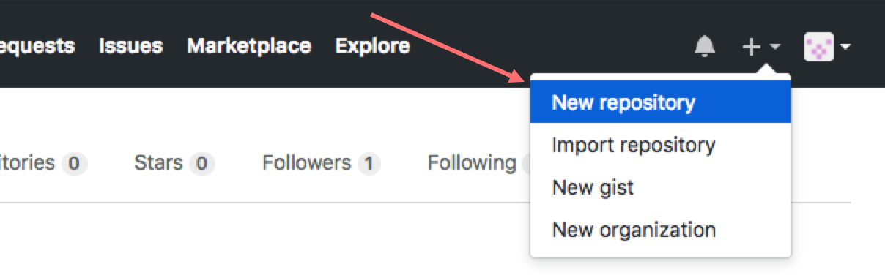
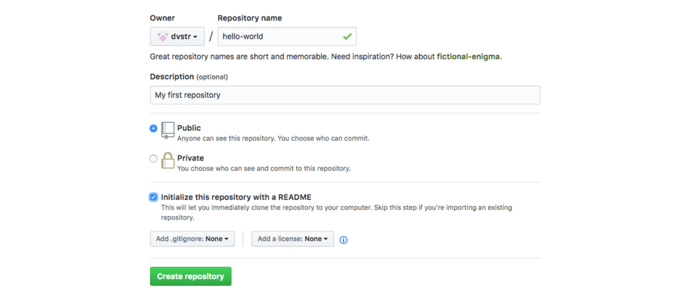
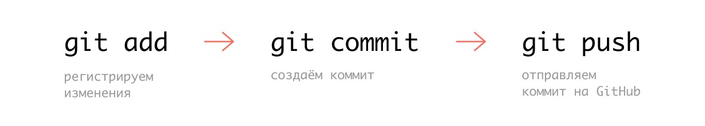
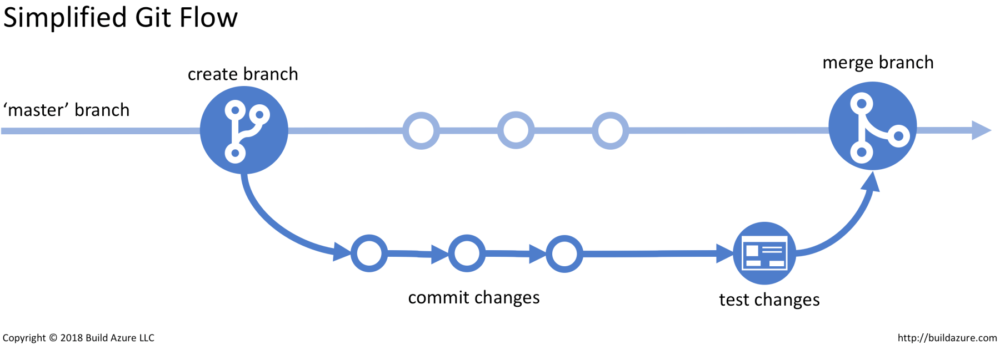

## 1. Установка GIT

[Инструкция по установке GIT](https://git-scm.com/download/)
на Windows, Mac, Linux.

## 2. Создание файла .gitignore

Для того что бы не нужные нам файлы не сохранялсь в репозитории нам нужно создать файл в котором будут прописаны имена файлов или их расширения который будут игонрироватьс. (Это могут быть локальные настройки проекта,сведения об ошибках, библиотеки и т.д.)

> Создаем файл с расширением с именем .gitignore и прописываем игнорируемые файлы 
````
.idea
.vscode
*.suo
*.ntvs*
*.njsproj
*.sln
*.sw?
.DS_Store
````
(Собрание известных файлов которые можно игнорировать можно посмотреть [Здесь](https://github.com/github/gitignore) )


## 3. Настройка Git

Для начала необходимо зарегистрироваться как пользователь системы — добавить в систему Имя пользователя и e-mail. Запустите Терминал, и выполните поочерёдно две команды
````
git config --global user.name "Your Name" 

git config --global user.email "you@abc.net"
````
*Для проверки можно воспользоваться этими командами, они покажут какие данные внесены в систему:*
````
git config user.name
git config user.email
````
## 4. Создание локального репозитория

*(Рекоммендую начать сразу с удаленного, смотреть пункт **7**)*

Для того что бы создать репозиторий на компьютере нужно запустить команду **get init**

````
get init
````
Команда создаст пустую папку с именем *.git* в папке вашего проэкта

##  5. Добавление файлов в репозиторий

Далее нужно добавить файлы в репозиторий *.git*. Для этого выполним команду 

````
git add .
````
> Команда добавит все файлы вашего проэкта. Для того что бы проверить какие файлы добавились можно использовать команду **git status**

## 6. Закоммитить!

Закоммитим изменения прибавив к нему комментарий 

````
git commit -m "fix mistakes on string 12"
````

## 7. Создание удаленного репозитория на GitHub

> Если работаем только с удаленным репозиторием шаги **3, 4** можно пропустить.

Удалённый репозиторий на GitHub — это облако, в котором хранятся файлы проекта и история их изменений. Локально же — это просто папка проекта на компьютере.

1. Регистрируемся на github.com
2. Создаем новый репозиторий

3. Откроется страница настройки нового репозитория (скрин ниже), на которой:
- вводится имя репозитория
- добавляется краткое описание проекта (не обязательно)
- выбирается тип репозитория
>*На GitHub есть два типа репозиториев — Public (будет виден всем, на странице вашего аккаунта, и все смогут писать коммиты), Private (будет виден только вам и тем, кому вы предоставите доступ в настройках репозитория).*

После такой элементарной настройки, уже можно создать репозиторий ⟶ зелёная кнопка Create repository.



## 8. Добавление удаленного репозитория

Что бы делать коммиты на наш удаленный репозиторий нужно добавить его через команду 
```
git remote add [имя_удаленного_репозитория] [адрес]
````
Например:

````
git remote add origin https://github.com/anton/example
````

## 9. Синхронизация с удаленным репозиторием (git push)

Чтобы локальные изменения синхронизировались с удалённым репозиторием, необходимо их сначала добавить, потом закоммитить, а потом запушить.




> Можно так же выбрать ветку куда "пушить" коммит. Для этого нужно указать название ветки: 
````
git push origin master
`````

### 9.1 Синхронизация с локальным репозиторием. (git pull)

Для обновления локального репозитория, после любых изменений проекта на удаленном репозитории (Например GitHub), в Терминале (надо находится в папке проекта) используется команда:

````
git pull
````
### 9.2 Копирование любого проэкта с GitHub

Для того что бы скопировать любой проект (не ваш) с GitHub себе на компьютер можно использовать команду **git clone ссылка url на проэкт**

Например:
````
git clone https://github.com/anton/example
````

## 10. Создание ветвей (branch) и переключение между ними.

Если у вас уже есть рабочая и стабильная версия продукта и вы хотите добавить новые функции не рискуя испортить уже стабильную версию, для этого нужно создать "копию" этой версии и уже работать над копией для последующего слияния (после тестов) с главной версией. 

Для этого существуют ответвления **(branch)**



> Большинство проектов включают две основные ветки – master и dev. Ветка master используется для продакшна, а dev – для тестирования. Когда новые изменения протестированы в ветке dev, их можно сливать с веткой master и после этого деплоить. Имена ветвей, их количество могут быть другими – это самые распространённые.


### 10.1 Команды для работы с ветвями

- **git branch** - *команда для создания новой ветки*.

Команда - **git branch имя ветки**

Например:
````
git branch dev
````
Появится новая ветка с именем **dev**

- **git checkout** - *команда для переключения веток с одной на другую*

Например:
````
git checkout dev
````
Мы переключимся с основной ветки **master** на **dev** 

> Для того что бы узнать на какой ветке вы находитесь в данный момент можно запустить команду **git branch** или **git status**. A
eсли мы хотим удалить ветку, мы можем сделать это с помощью команды **git branch -d имя ветки** (в нашем случае ``git branch -d dev``). Разумеется перед удалением нужно будет переключится на другую ветку.

- **git merge** - *команда для слияния веток*.

Для того что бы слить ветки нужно сначала перейти в главную ветку **master** с помощью команды **git checkout** и вызвать команду слияние **git merge**.

Например:

````
git checkout master
`````
Так мы переключились на главную ветку **master**

````
git merge dev
`````
И так мы слили ветку **dev** в ветку **master**


